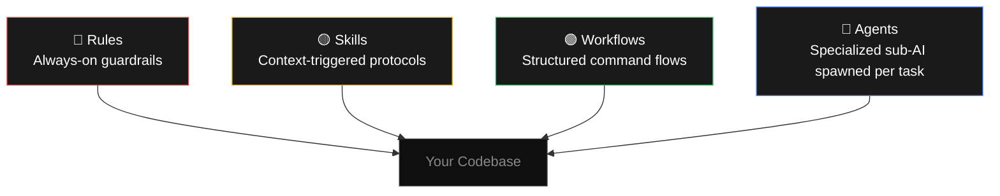
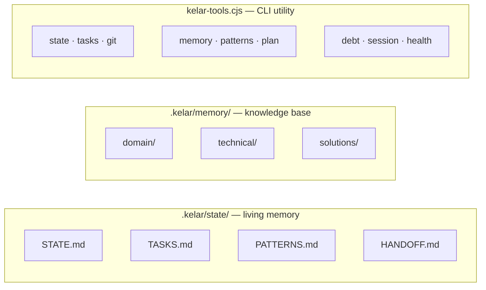
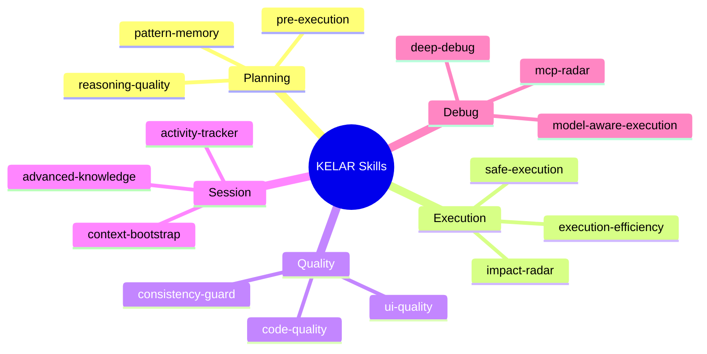
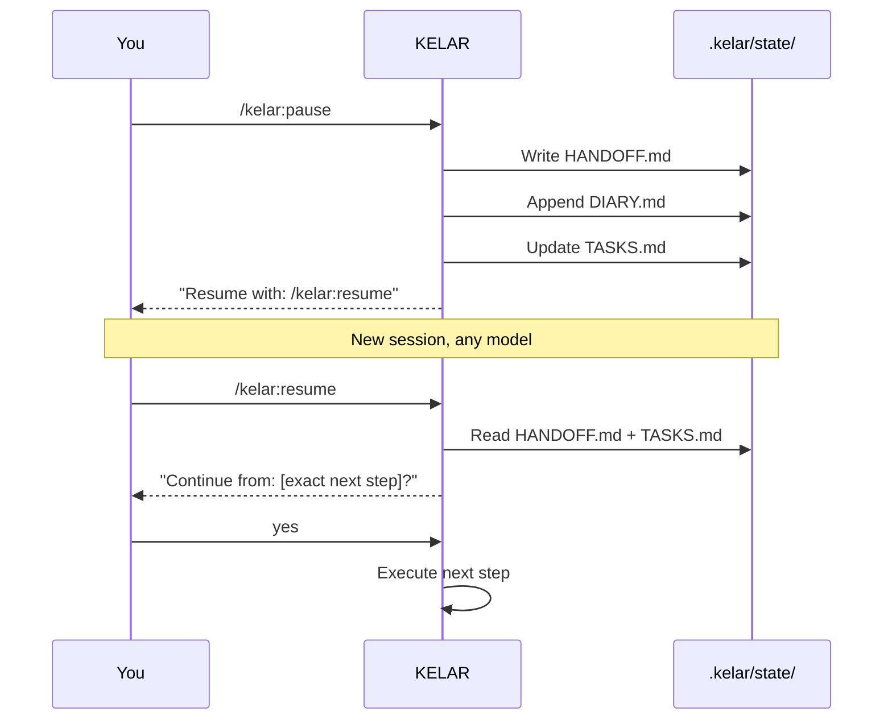

<div align="center">

# KELAR

**Kept Efficient, Logical, Atomic, Resilient**

*The AI execution system for developers who are done babysitting.*
*Sistem eksekusi AI untuk developer yang sudah bosan ngatur-ngatur AI-nya.*

[](https://npmjs.com/package/kelar-cli)
[](./LICENSE)
[](.)

> ```npx kelar-cli@latest init```

</div>

---

## The Problem

AI coding tools fail in predictable ways. You ask for a feature — it touches files you didn't mention, hardcodes values, ignores your patterns. You ask it to fix a bug — it wraps the symptom in a try-catch. You hit a context limit — it greets you like a stranger.

KELAR fixes that. It's a layer of **rules, skills, agents, and workflows** that sits on top of your AI agent and makes it behave like a senior developer.

---

## How It Works

KELAR has four layers. Each one does a different job.





---

## Multi-Agent Pipeline

The core of KELAR v2. When you run `/kelar:feature`, it orchestrates specialized agents — some in parallel, some sequential — each with a fresh context window.

```mermaid
flowchart TD
    U([User Request]) --> O[Orchestrator]

    O --> R[kelar-researcher]
    O --> UI[kelar-ui-designer]

    R --> P[kelar-planner]
    UI --> P

    P --> C[kelar-plan-checker]
    C -->|REJECTED| P
    C -->|APPROVED| G{User Gate}

    G -->|yes| W1

    subgraph W1 [Wave 1 — parallel]
        E1[kelar-executor]
        E2[kelar-executor]
        E3[kelar-executor]
    end

    subgraph W2 [Wave 2 — sequential]
        E4[kelar-executor]
    end

    W1 --> REP{Verify}
    REP -->|fail| FIX[kelar-repair]
    FIX --> W2
    REP -->|pass| W2

    W2 --> V[kelar-verifier]
    V --> DONE([✅ Complete])

    style G fill:#1a1a2e,stroke:#7c3aed,color:#fff
    style DONE fill:#1a1a1a,stroke:#22c55e,color:#fff
    style W1 fill:#0f172a,stroke:#3b82f6
    style W2 fill:#0f172a,stroke:#3b82f6
```



---

## Install

```bash
npx kelar-cli@latest init
```

Then run once on any project:

```bash
/kelar:map
```

*KELAR scans your codebase and writes a full architecture map to `.kelar/state/STATE.md`. After this, every agent knows your project cold.*

---

## Commands

| Command | What it does |
|---------|-------------|
| `/kelar:map` | Scan codebase — run once per project |
| `/kelar:feature [desc]` | Full multi-agent feature pipeline |
| `/kelar:fix [error]` | Root cause debug + verified fix |
| `/kelar:quick [desc]` | Small focused task, 1–3 files |
| `/kelar:status` | Live project dashboard |
| `/kelar:pause` | Save session state before stopping |
| `/kelar:resume` | Restore exactly where you left off |

---

## Agents

Nine specialized sub-agents, each with a single responsibility and a fresh context window.

| Agent | Role |
|-------|------|
| `kelar-planner` | Creates XML task plans — precise enough for executors to work without asking questions |
| `kelar-executor` | Implements one task at a time from a plan |
| `kelar-researcher` | Investigates libraries, APIs, and codebase patterns before planning starts |
| `kelar-plan-checker` | Validates plans before execution — catches bad tasks before they waste time |
| `kelar-verifier` | Confirms goals were actually achieved, not just that code compiled |
| `kelar-debugger` | Traces bugs 3+ levels deep to root cause. Never patches symptoms |
| `kelar-repair` | Autonomous recovery: Retry → Decompose → Prune before escalating to you |
| `kelar-ui-designer` | Design contracts and all 8 component states before any UI code is written |
| `kelar-codebase-mapper` | Full architecture analysis — stack, layers, conventions, anti-patterns |

---

## Skills

Fourteen context-triggered protocols. Auto-activated based on task type — lightweight for small tasks, thorough for complex ones.



---

## Session Continuity

Context limit? Model switch? KELAR doesn't lose context. Setiap sesi tersimpan — resume kapanpun.



---

## kelar-tools

A CLI utility powering all agents and workflows internally. You can also use it directly.

```bash
node .kelar/kelar-tools.cjs health               # check system integrity
node .kelar/kelar-tools.cjs state snapshot       # project state as JSON
node .kelar/kelar-tools.cjs tasks log done "..."  # log task completion
node .kelar/kelar-tools.cjs memory search "jwt"  # search knowledge base
node .kelar/kelar-tools.cjs memory save technical "title" "content"
node .kelar/kelar-tools.cjs git commit "feat(kelar): add UserService"
node .kelar/kelar-tools.cjs git checkpoint       # stash before risky change
node .kelar/kelar-tools.cjs plan validate .kelar/plans/feat-plan.xml
node .kelar/kelar-tools.cjs debt add "file.ts" "N+1 query" "HIGH"
```

---

## File Structure

```
your-project/
├── AGENTS.md                    ← universal agent config (all tools)
├── CLAUDE.md                    ← Claude Code overrides
├── GEMINI.md                    ← Antigravity overrides
│
└── .kelar/
    ├── kelar-tools.cjs          ← CLI utility (30+ commands)
    ├── agents/                  ← 9 specialized sub-agents
    ├── skills/                  ← 14 context-triggered protocols
    ├── workflows/               ← 6 command flows
    ├── rules/                   ← 3 always-on guardrails
    ├── state/                   ← session tracking (not committed)
    │   ├── STATE.md
    │   ├── TASKS.md
    │   ├── PATTERNS.md
    │   └── HANDOFF.md
    └── memory/                  ← knowledge base (committed)
        ├── domain/
        ├── technical/
        └── solutions/
```

---

## Compatibility

| Agent | Rules | Skills | Workflows | Agents |
|-------|-------|--------|-----------|--------|
| Claude Code | ✅ | ✅ | ✅ | ✅ |
| Antigravity | ✅ | ✅ | ✅ | ✅ |
| Cursor | ✅ | — | — | — |
| Windsurf | ✅ | — | — | — |

---

## Philosophy

1. **Plan before code** — no line is written without an approved plan
2. **Atomic tasks** — every unit of work is small enough to verify and revert independently
3. **Append-only memory** — state files are never overwritten; history is permanent
4. **Explicit over implicit** — agents declare what they'll do, you approve, then they do it
5. **Surgical scope** — touch only what was declared; everything else goes to `DEBT.md`

---

<div align="center">

<br/>


> ***Powered by AI,<br/>
optimized by trial and error… berkali-kali 😄***


> `npx kelar-cli@latest init`

MIT License · [zeative/kelar](https://github.com/zeative/kelar)

</div>